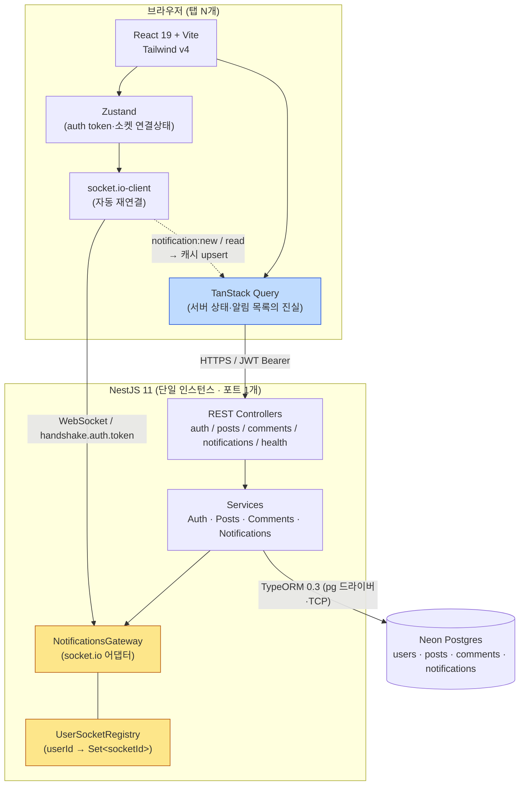
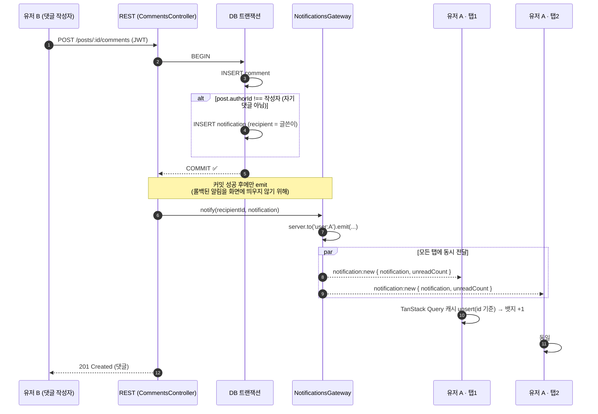
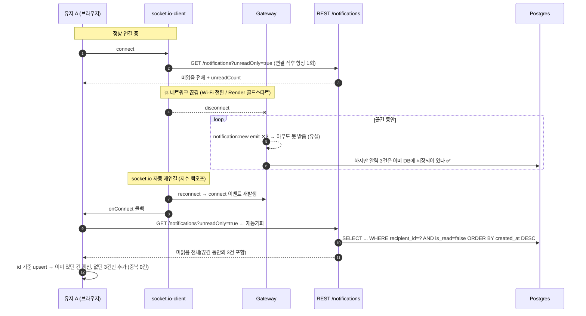
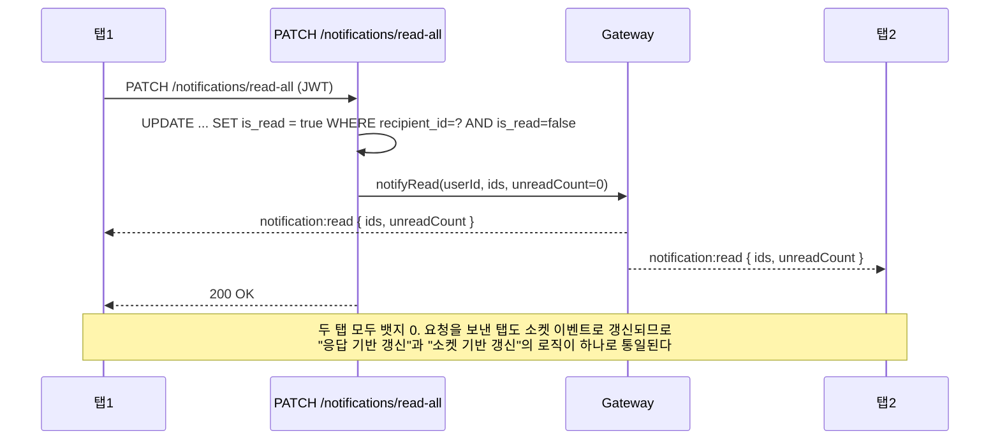

# pingboard — ARCHITECTURE

> 이 문서의 중심은 **WebSocket Gateway 설계**다. 나머지(게시판 CRUD)는 표준 NestJS 레이어 구조를 따르며 특별할 게 없다.

---

## 1. 시스템 구성도



**핵심 배치 원칙 3가지**

1. **DB가 알림의 유일한 진실이다.** 소켓은 "DB에 이미 저장된 사실을 빨리 알려주는 힌트 채널"일 뿐이다. 소켓으로만 존재하는 알림은 없다.
2. **REST와 소켓은 같은 프로세스·같은 포트**를 쓴다(NestJS Gateway는 기본적으로 HTTP 서버를 공유). Render/Vercel 어느 쪽이든 포트 1개만 열면 되고, CORS 설정도 한 군데서 관리한다.
3. **프론트에서 알림 목록의 소유자는 TanStack Query 캐시 하나뿐이다.** 소켓 이벤트는 별도 상태를 만들지 않고 캐시를 upsert한다 → 이게 SC-3(중복 0건)의 구조적 근거.

---

## 2. WebSocket Gateway 설계 (핵심)

### 2-1. 연결 인증 — `afterInit`의 `server.use()` 미들웨어

```
클라이언트                                서버
  io(url, { auth: { token } })  ──────▶  server.use(authMiddleware)
                                            jwtService.verifyAsync(token)
                                            ├─ 성공 → socket.data.userId = sub; next()
                                            └─ 실패 → next(new Error('UNAUTHORIZED'))
                                                       ↓
  socket.on('connect_error')     ◀──────  connect_error 전달, 연결 거부
  socket.active === false  → 재시도 안 함
```

**왜 `handleConnection`에서 `disconnect()` 하지 않고 미들웨어에서 거부하는가 (설계 근거)**

- socket.io v4 공식 문서 기준, **미들웨어에서 거부된 연결은 클라이언트가 자동 재연결하지 않는다**(`socket.active === false`, 재연결하려면 `socket.connect()`를 직접 호출해야 함).
- 반대로 `handleConnection` 안에서 `socket.disconnect()`를 호출하면 클라이언트는 이를 "일시적 끊김"으로 보고 **무한 재연결 루프**를 돈다. 토큰 만료 시 초당 수 회 폴링이 서버를 때린다 — 이게 SC-7이 잡으려는 실패다.
- 클라이언트는 `connect_error`에서 `socket.active === false`이면 토큰을 폐기하고 로그인 화면으로 보낸다.

**왜 커스텀 IoAdapter를 만들지 않는가**: `@WebSocketGateway`가 구현하는 `OnGatewayInit.afterInit(server)`에서 `server.use()`를 호출하면 동일한 결과를 얻는다. 어댑터를 상속하면 파일 하나와 부트스트랩 배선이 더 늘 뿐이다(ponytail).

### 2-2. userId → 소켓 매핑 — **room이 1차, Registry가 보조**

같은 유저가 탭 3개를 열면 **소켓 인스턴스도 3개**다(socket.id 3개). 신입 구현에서 가장 흔한 버그는 다음 한 줄이다.

```ts
// ❌ 안티패턴: 마지막에 연결한 탭이 앞의 탭을 덮어쓴다 → 다른 탭은 알림을 영원히 못 받음
this.userSockets.set(userId, socket);
```

pingboard는 두 층으로 나눈다.

| 층                                   | 자료구조                                            | 책임                             | 왜 필요한가                                                                                                                  |
| ------------------------------------ | --------------------------------------------------- | -------------------------------- | ---------------------------------------------------------------------------------------------------------------------------- |
| **① socket.io room** (전달 담당)     | socket.io 내부 (`user:{userId}`)                    | 실제 브로드캐스트                | `server.to('user:'+id).emit(...)` 한 줄로 N개 연결에 모두 전달. 끊긴 소켓의 room 제거를 socket.io가 알아서 해준다(누수 없음) |
| **② UserSocketRegistry** (관측 담당) | `Map<string, Set<string>>` (userId → socketId 집합) | 연결 수 카운트, 온라인 여부 판정 | room 멤버 수 조회는 비동기 API라 매번 await해야 하고, "연결 수 배지(F10)"·서버 로그·향후 오프라인 판정에 동기 조회가 편하다  |

```ts
// 연결 시 (handleConnection)
const userId = socket.data.userId;
socket.join(`user:${userId}`); // ① 전달 채널
const count = this.registry.add(userId, socket.id); // ② 관측
this.server.to(`user:${userId}`).emit("presence:sync", { connections: count });

// 해제 시 (handleDisconnect) — room 탈퇴는 socket.io가 자동 처리
const count = this.registry.remove(userId, socket.id); // Set이 비면 Map 키까지 삭제(메모리 누수 방지)
if (count > 0)
  this.server
    .to(`user:${userId}`)
    .emit("presence:sync", { connections: count });

// 알림 발송 (서비스 → 게이트웨이) — 탭이 몇 개든 이 한 줄
this.server
  .to(`user:${recipientId}`)
  .emit("notification:new", { notification, unreadCount });
```

**Registry가 반드시 지켜야 할 것**: `remove` 시 `Set`이 비면 `Map`에서 키 자체를 삭제한다. 안 그러면 방문한 모든 유저 id가 프로세스 생존 기간 내내 빈 Set으로 남는다(느린 메모리 누수 — 코드리뷰 단골).

**단일 인스턴스 전제 명시**: Registry는 프로세스 로컬 메모리다. 인스턴스를 2개로 늘리면 A 인스턴스의 emit이 B 인스턴스에 붙은 탭에 닿지 않는다 → 그때 필요한 것이 `@socket.io/redis-adapter`다. **지금은 구현하지 않고 README/STUDY에 "왜 지금은 필요 없고 언제 필요해지는지"로 서술한다.**

### 2-3. 왜 소켓이 아니라 서비스에서 알림을 만드는가 (의존 방향)

`CommentsService` → `NotificationsService` → `NotificationsGateway` 단방향이다. Gateway는 **아무 비즈니스 로직도 갖지 않고 emit만 한다.**
클라이언트가 서버로 보내는 이벤트는 **0개**다(읽음 처리도 REST). 이유:

- 인증·검증·에러 응답·Swagger 문서화가 이미 정비된 REST 파이프라인을 두 벌로 만들 이유가 없다.
- 쓰기 경로가 REST 하나면 "소켓으로 들어온 쓰기 요청은 어떻게 검증하지?"라는 두 번째 보안 표면이 생기지 않는다.

---

## 3. 흐름 다이어그램

### 3-1. 정상 흐름 — 댓글 작성 → 실시간 알림 (다중 탭 포함)



**설계 포인트**

- **트랜잭션 경계**: 댓글 INSERT와 알림 INSERT는 한 트랜잭션(SC-8). "댓글은 달렸는데 알림이 없다"는 상태를 구조적으로 없앤다.
- **emit은 커밋 밖**: 트랜잭션 안에서 emit하면 이후 롤백 시 존재하지 않는 알림이 화면에 남는다. 반드시 `COMMIT` 이후.
- **`unreadCount`를 함께 실어 보낸다**: 클라이언트가 카운트를 직접 증감하지 않게 해서 탭 간 카운트가 어긋나는 걸 막는다(서버 계산값이 항상 우선).
- Neon 참고: `linkstash-ai`에서 겪은 "서버리스 드라이버 인터랙티브 트랜잭션 끊김"은 **HTTP 서버리스 드라이버** 이슈였다. pingboard는 TypeORM + `pg`(TCP) 조합이라 해당 없음 — 일반 트랜잭션을 그대로 쓴다.

### 3-2. 재연결 유실 방지 흐름 ⭐ (SC-2 / SC-3)



**핵심 설계 결정 4가지**

1. **"마지막 확인 시각 이후"를 커서로 관리하지 않는다.** 클라이언트가 시계나 커서를 들고 있으면 시간 동기화·시계 스큐·커서 유실 문제가 따라온다. `is_read = false`라는 **서버가 소유한 상태**가 곧 "아직 확인 안 한 것"의 정의다. 재동기화는 그냥 미읽음 전체 조회다 — 단순하고 멱등하다.
2. **재동기화 트리거는 소켓의 `connect` 이벤트 하나로 통일.** socket.io-client는 재연결 성공 시에도 `connect`를 다시 발생시키므로, 최초 연결/재연결을 구분할 필요가 없다. 콜백은 `queryClient.invalidateQueries(['notifications'])` 한 줄.
3. **TanStack Query의 `refetchOnWindowFocus`(기본 true)가 2차 안전망.** 탭 복귀 시에도 자동 재조회된다.
4. **socket.io `connectionStateRecovery`를 쓰지 않는 이유** — 공식 문서상 이 기능은 **복구에 실패할 수 있고, 실패하면 결국 애플리케이션이 재동기화를 해야 한다**. 즉 REST 재동기화 경로는 어차피 필요하다. 그렇다면 세션 저장·유효기간·서버 재시작 시 무효화라는 추가 변수를 안고 갈 이유가 없다(ponytail). 이 판단 자체를 STUDY/면접 답변으로 쓴다.

### 3-3. 읽음 처리 & 탭 간 동기화 (SC-5)



---

## 4. 폴더 구조

단일 레포에 `server/`와 `client/`를 나란히 둔다. 워크스페이스 툴(turbo/pnpm workspace)은 쓰지 않는다 — 각 폴더가 독립 `package.json`을 갖고, Vercel은 `client/`를, Render는 `server/`를 루트로 지정한다(S 티어에 모노레포 도구는 과설계).

```
pingboard/
├─ SPEC.md · ARCHITECTURE.md · DATA-MODEL.md · API.md · PLAN.md
├─ README.md                        # 실행법 + 다이어그램 + 데모 GIF 3종(SC-2/3/4)
├─ .github/workflows/ci.yml         # server: lint→build→test / client: build
├─ server/
│  ├─ Dockerfile                    # multi-stage, node:22-alpine
│  ├─ src/
│  │  ├─ main.ts                    # CORS 화이트리스트, ValidationPipe, Swagger
│  │  ├─ app.module.ts
│  │  ├─ config/
│  │  │  ├─ data-source.ts          # TypeORM CLI용 DataSource (마이그레이션 생성/실행)
│  │  │  └─ typeorm.config.ts       # 앱 런타임 설정 (ssl 판별 포함)
│  │  ├─ common/
│  │  │  ├─ entities/base.entity.ts # uuid PK + createdAt 공통
│  │  │  └─ filters/                # 전역 예외 필터(응답 형태 일관성)
│  │  ├─ health/                    # GET /health
│  │  ├─ auth/
│  │  │  ├─ auth.controller.ts / auth.service.ts / auth.module.ts
│  │  │  ├─ dto/ (register.dto.ts, login.dto.ts)   ← login에만 admin 예외
│  │  │  ├─ jwt.strategy.ts / jwt-auth.guard.ts
│  │  │  └─ current-user.decorator.ts
│  │  ├─ users/user.entity.ts
│  │  ├─ posts/                     # entity · controller · service · dto
│  │  ├─ comments/                  # entity · controller · service · dto  ← 알림 트리거 지점
│  │  └─ notifications/
│  │     ├─ notification.entity.ts
│  │     ├─ notifications.controller.ts   # REST: 목록 · 카운트 · 읽음
│  │     ├─ notifications.service.ts      # 생성/조회/읽음 + emit 호출
│  │     ├─ notifications.gateway.ts      # ⭐ 소켓 인증 미들웨어 + room join + emit
│  │     ├─ user-socket.registry.ts       # ⭐ Map<userId, Set<socketId>>
│  │     └─ notifications.module.ts
│  ├─ migrations/                   # TypeORM 마이그레이션 (DATA-MODEL.md 참고)
│  ├─ scripts/seed-demo.ts          # admin 계정 + 샘플 글/댓글/알림 (멱등)
│  └─ test/                         # *.spec.ts (단위) · app.e2e-spec.ts (supertest)
└─ client/
   ├─ src/
   │  ├─ main.tsx / App.tsx / router.tsx
   │  ├─ lib/
   │  │  ├─ api.ts                  # axios 인스턴스 + JWT 인터셉터
   │  │  ├─ socket.ts               # io() 싱글턴 (auth.token 주입)
   │  │  └─ schemas.ts              # Zod 스키마 (폼 검증 + 응답 파싱)
   │  ├─ stores/auth.store.ts       # Zustand: token, user
   │  ├─ hooks/
   │  │  ├─ useNotificationSocket.ts # ⭐ connect→재동기화, new/read→캐시 upsert
   │  │  └─ useNotifications.ts      # TanStack Query 훅(목록·카운트·읽음 mutation)
   │  ├─ components/
   │  │  ├─ NotificationBell.tsx     # 뱃지 + 드롭다운
   │  │  ├─ ConnectionBadge.tsx      # 활성 탭 수(F10) — 다중 탭 시연용
   │  │  └─ ...
   │  └─ pages/ (LoginPage · PostListPage · PostDetailPage · PostWritePage)
   └─ vite.config.ts · index.html
```

---

## 5. 기술 선택 근거

| 결정                          | 선택                               | 근거                                                                                                                                                                                                                                       |
| ----------------------------- | ---------------------------------- | ------------------------------------------------------------------------------------------------------------------------------------------------------------------------------------------------------------------------------------------ |
| 실시간 라이브러리             | **socket.io** (NestJS 기본 어댑터) | 리서치상 국내 신입 포트폴리오·NestJS 생태계 모두 압도적 주류. 재연결/room을 라이브러리가 처리해줘서 S 티어 하루 스코프에 맞고, **내가 직접 풀어야 할 문제(유실·다중탭)에 시간을 몰아줄 수 있다**. 순수 `ws`는 초저지연 게임류 외 실익 없음 |
| 단방향 알림인데 SSE 아닌 이유 | socket.io                          | 지금은 서버→클라 단방향이라 SSE도 가능하지만, room 기반 다중 연결 관리와 재연결 백오프를 직접 짜야 한다. 또 포트폴리오 목적상 "WebSocket 유형" 커버리지가 필요                                                                             |
| ORM                           | **TypeORM 0.3**                    | 워크스페이스 ORM 균형(Prisma 2회 / TypeORM 1회 → 이번에 TypeORM). Repository·QueryBuilder·마이그레이션 CLI를 다룰 줄 안다는 증거                                                                                                           |
| 커스텀 IoAdapter              | **안 만든다**                      | `afterInit(server) → server.use()`로 동일 효과. 파일·배선만 늘어남                                                                                                                                                                         |
| Redis 어댑터                  | **안 넣는다**                      | 단일 인스턴스에서는 순수 오버헤드. "언제 필요한가"를 설명할 수 있으면 면접 목적은 달성                                                                                                                                                     |
| 토큰 저장 위치                | localStorage                       | 소켓 핸드셰이크(`auth.token`)에 JS로 토큰을 넣어야 해서 httpOnly 쿠키는 별도 설계가 필요. **XSS 시 탈취 가능하다는 트레이드오프를 README에 정직하게 명시**하고, 운영이라면 쿠키+CSRF 조합이라고 서술                                       |
| Refresh Token                 | **없음** (access 단일, 1일)        | newGym에서 이미 커버. S 티어에서 반복 구현은 시간 낭비                                                                                                                                                                                     |
| 알림 목록 상태 관리           | TanStack Query 캐시 단일 소유      | 소켓 수신분을 Zustand에 따로 쌓으면 REST 재조회분과 두 벌이 되어 **중복/불일치(SC-3 실패)**가 구조적으로 발생. 캐시 upsert 단일 경로로 강제                                                                                                |
| 클라 → 서버 소켓 이벤트       | **0개**                            | 쓰기 경로를 REST로 단일화 → 검증·인증·문서화가 한 벌                                                                                                                                                                                       |
| 페이지네이션                  | 게시글 offset / 알림 limit         | 알림은 미읽음 전체를 통째로 받는 게 재동기화 로직을 단순하게 만든다(상한 100건 가드). 커서 페이지네이션은 linkstash-ai에서 커버됨                                                                                                          |
| 통합 테스트(Testcontainers)   | 미포함                             | CLAUDE.md S 티어 표에서 면제. 대신 리포지토리 목 기반 단위 테스트로 알림 규칙을 고정                                                                                                                                                       |

---

## 6. 알려진 한계 (README에도 그대로 적는다)

1. **단일 인스턴스 전용** — 수평 확장 시 Redis 어댑터 필요.
2. **재동기화는 미읽음 전체 조회** — 미읽음이 수천 건 쌓이면 페이로드가 커진다(현재 100건 상한 + 인덱스로 방어). 대규모라면 `since` 커서 방식이 맞다.
3. **localStorage 토큰** — XSS 취약 가능성. 운영 등급이면 httpOnly 쿠키 + 소켓 핸드셰이크 시 쿠키 기반 인증으로 전환해야 한다.
4. **알림 타입 1종** — 확장 시 `type`별 렌더러 분기와 payload 스키마 분리가 필요하다.
