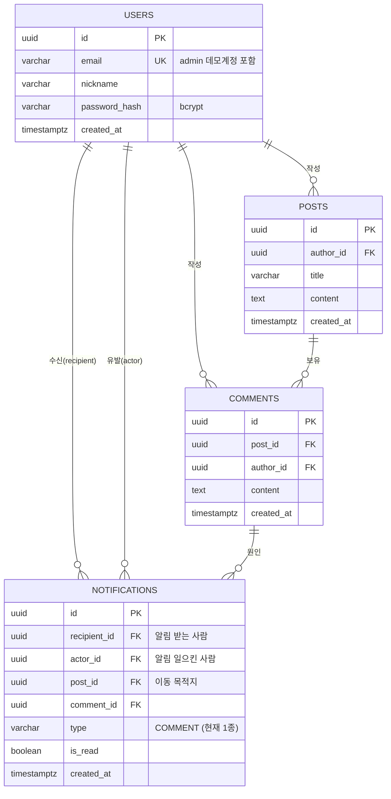

# pingboard — DATA MODEL

> TypeORM 0.3 엔티티 기준. DB는 Neon Postgres, 드라이버는 `pg`(TCP). 테이블 4개로 끝난다.

---

## 1. ERD



---

## 2. 테이블 정의

### 2-1. `users`

| 컬럼            | 타입           | 제약                    | 비고                                             |
| --------------- | -------------- | ----------------------- | ------------------------------------------------ |
| `id`            | `uuid`         | PK, `gen_random_uuid()` | pgcrypto 내장 함수 (uuid-ossp 확장 불필요)       |
| `email`         | `varchar(255)` | **UNIQUE**, NOT NULL    | 데모 계정은 값이 `admin` — 형식 검증은 앱 레이어 |
| `nickname`      | `varchar(30)`  | NOT NULL                | 목록/알림 문구에 노출                            |
| `password_hash` | `varchar(60)`  | NOT NULL                | bcrypt cost 10. **데모 계정도 동일 해시 경로**   |
| `created_at`    | `timestamptz`  | NOT NULL, `now()`       |                                                  |

- `email` UNIQUE는 중복 가입 방지의 **최종 방어선**이다. 앱에서 사전 조회로 검사해도 동시 요청이면 뚫리므로, DB 제약 위반(`23505`)을 잡아 409로 변환한다.
- `gen_random_uuid()` 선택 이유: newGym에서 커스텀 스키마 + `search_path` 때문에 `uuid-ossp` 함수를 못 찾는 사고가 있었다. PG13+ 내장 함수를 쓰면 확장 설치 자체가 필요 없다. **스키마도 `public`을 그대로 쓴다**(같은 사고 예방).

### 2-2. `posts`

| 컬럼         | 타입           | 제약                                           |
| ------------ | -------------- | ---------------------------------------------- |
| `id`         | `uuid`         | PK                                             |
| `author_id`  | `uuid`         | FK → `users.id`, NOT NULL, `ON DELETE CASCADE` |
| `title`      | `varchar(120)` | NOT NULL                                       |
| `content`    | `text`         | NOT NULL                                       |
| `created_at` | `timestamptz`  | NOT NULL, `now()`                              |

### 2-3. `comments`

| 컬럼         | 타입          | 제약                                           |
| ------------ | ------------- | ---------------------------------------------- |
| `id`         | `uuid`        | PK                                             |
| `post_id`    | `uuid`        | FK → `posts.id`, NOT NULL, `ON DELETE CASCADE` |
| `author_id`  | `uuid`        | FK → `users.id`, NOT NULL, `ON DELETE CASCADE` |
| `content`    | `text`        | NOT NULL                                       |
| `created_at` | `timestamptz` | NOT NULL, `now()`                              |

### 2-4. `notifications` ⭐

| 컬럼           | 타입          | 제약                                              | 비고                                      |
| -------------- | ------------- | ------------------------------------------------- | ----------------------------------------- |
| `id`           | `uuid`        | PK                                                | 클라이언트 중복 병합 키(SC-3)             |
| `recipient_id` | `uuid`        | FK → `users.id`, NOT NULL, `ON DELETE CASCADE`    | 조회는 **항상** 이 컬럼으로 시작          |
| `actor_id`     | `uuid`        | FK → `users.id`, NOT NULL, `ON DELETE CASCADE`    | "OO님이 댓글을 남겼습니다"                |
| `post_id`      | `uuid`        | FK → `posts.id`, NOT NULL, `ON DELETE CASCADE`    | 클릭 시 이동 목적지                       |
| `comment_id`   | `uuid`        | FK → `comments.id`, NOT NULL, `ON DELETE CASCADE` | 본문 미리보기용                           |
| `type`         | `varchar(20)` | NOT NULL, 기본 `'COMMENT'`                        | 현재 1종. **enum 타입 안 씀 — 아래 참고** |
| `is_read`      | `boolean`     | NOT NULL, 기본 `false`                            |                                           |
| `created_at`   | `timestamptz` | NOT NULL, `now()`                                 | 정렬 키                                   |

**`type`을 Postgres `enum` 타입이 아니라 `varchar`로 두는 이유**: PG enum에 값을 추가하려면 `ALTER TYPE`이 필요하고 TypeORM 마이그레이션에서 다루기 번거롭다. 값이 1종뿐인 현재 시점에서 얻는 게 없다. 애플리케이션 레이어에서 TS union(`'COMMENT'`)으로 좁힌다.

**FK가 전부 `ON DELETE CASCADE`인 이유**: 게시글/댓글 삭제 기능은 없지만, 유저 삭제나 데이터 정리 시 알림만 유령으로 남는 걸 막는다. 알림은 원본 없이는 의미가 없는 파생 데이터다.

---

## 3. 인덱스 설계

| #   | 인덱스                                                         | 대상 쿼리                        | 근거                                                                            |
| --- | -------------------------------------------------------------- | -------------------------------- | ------------------------------------------------------------------------------- |
| I1  | `users(email)` UNIQUE                                          | 로그인 조회 · 중복 가입 방지     | UNIQUE 제약이 인덱스를 겸함                                                     |
| I2  | `posts(created_at DESC)`                                       | 게시글 목록 최신순               | 정렬 전용. 소량이라도 seq scan+sort를 피하는 기본기                             |
| I3  | `comments(post_id, created_at ASC)`                            | 상세 페이지의 댓글 목록          | 선행 컬럼으로 필터, 후행 컬럼으로 정렬 → 인덱스만으로 정렬 완료(추가 sort 없음) |
| I4  | **`notifications(recipient_id, is_read, created_at DESC)`** ⭐ | 미읽음 목록 조회 + 미읽음 카운트 | 아래 상세                                                                       |

### 3-1. I4 복합 인덱스 — 컬럼 순서가 핵심

이 프로젝트의 뜨거운 쿼리는 정확히 두 개이고, 둘 다 같은 형태다.

```sql
-- (a) 재연결/로그인 시 미읽음 목록 (SC-2의 심장)
SELECT * FROM notifications
 WHERE recipient_id = $1 AND is_read = false
 ORDER BY created_at DESC LIMIT 100;

-- (b) 뱃지 카운트
SELECT count(*) FROM notifications
 WHERE recipient_id = $1 AND is_read = false;
```

컬럼 순서를 `(recipient_id, is_read, created_at DESC)`로 잡은 이유:

1. **`recipient_id` 선행** — 등호 조건이자 카디널리티가 가장 높다. 이걸 앞에 둬야 다른 유저의 알림 전체를 스캔 대상에서 즉시 제거한다.
2. **`is_read` 중간** — 역시 등호 조건. 여기까지가 "찾을 행의 집합"을 확정한다.
3. **`created_at DESC` 후행** — 범위/정렬 컬럼은 반드시 등호 컬럼 뒤에 온다. 앞에 두면 정렬은 되지만 `recipient_id` 필터가 인덱스로 안 먹는다. 이 순서라면 `ORDER BY created_at DESC LIMIT 100`이 **인덱스를 역순으로 훑고 100건에서 멈춘다**(정렬 단계 자체가 사라짐).

**검토했으나 채택하지 않은 대안 — 부분 인덱스**

```sql
CREATE INDEX ... ON notifications (recipient_id, created_at DESC) WHERE is_read = false;
```

읽은 알림이 쌓일수록 인덱스가 작아져서 이론적으로 더 좋다. 하지만 (a) 읽은 알림까지 보는 "전체 목록" 조회에는 이 인덱스가 쓰이지 않아 인덱스가 2개 필요해지고, (b) 데모 규모에서 이득이 측정되지 않는다. **I4 하나로 (a)(b) 두 쿼리를 모두 커버하는 쪽을 택했다.** 이 트레이드오프 자체를 STUDY/면접 답변으로 쓴다.

### 3-2. N+1 방지 (설계 시점에 못 박는다)

| 화면        | 순진한 구현의 N+1                                | pingboard 구현                                                                                                              |
| ----------- | ------------------------------------------------ | --------------------------------------------------------------------------------------------------------------------------- |
| 게시글 목록 | 글 20개 → 작성자 20회 + 댓글수 20회 = **41쿼리** | QueryBuilder `leftJoin('post.author')` + `loadRelationCountAndMap('post.commentCount','post.comments')` → **쿼리 2개 이내** |
| 게시글 상세 | 댓글 N개 → 작성자 N회                            | `leftJoinAndSelect('comment.author')` → **1쿼리**                                                                           |
| 알림 목록   | 알림 20개 → actor·post 각 20회 = **41쿼리**      | `leftJoinAndSelect('n.actor')` + `leftJoinAndSelect('n.post')` → **1쿼리**                                                  |

- 엔티티 관계는 **전부 `lazy: false` + 명시적 조인**으로 간다. `eager: true`는 필요 없는 화면에서도 조인이 따라붙어 되레 낭비다.
- `select`로 컬럼을 좁힌다 — 알림 목록에서 `post.content`(text 전문)까지 끌어오지 않는다. 응답 페이로드는 DTO로 잘라서 내보낸다.
- 개발 환경에서 `logging: ['query']`를 켜고 **목록 3화면의 쿼리 수를 실제로 세어 README에 적는다**(주장이 아니라 증거).

### 3-3. 정규화 판단

3NF를 지킨다. 다만 **비정규화 유혹 2개를 의도적으로 거절**했다.

- `users.unread_count` 캐시 컬럼 → ❌. 알림 생성/읽음마다 갱신해야 하고 동시성 시 어긋난다. I4 인덱스가 있으면 `count(*)`는 인덱스 스캔이라 이 규모에서 충분히 빠르다.
- `notifications.message` (완성된 문구 저장) → ❌. 닉네임이 바뀌면 과거 알림이 옛 닉네임으로 남는다. 조인으로 현재 값을 읽는다.

---

## 4. 마이그레이션 전략

### 4-1. 원칙: `synchronize: false` 고정, 스키마 변경은 100% 마이그레이션 파일

newGym에서 겪은 문제 — 마이그레이션이 초기 스키마를 전제하지 못해 빈 DB에서 실패했고, 결국 `synchronize`로 최초 부트스트랩을 때웠다. pingboard는 처음부터 **초기 스키마 자체를 마이그레이션 1번으로 만든다.** 빈 DB에 `migration:run` 한 번이면 완성된다.

```
migrations/
  1750000000000-InitSchema.ts     # users, posts, comments, notifications + I1~I4 인덱스 전부
```

- `server/src/config/data-source.ts` — CLI 전용 `DataSource` (entities/migrations 경로, `.env`의 `DATABASE_URL`)
- npm 스크립트
  - `migration:generate` → `typeorm-ts-node-commonjs migration:generate -d src/config/data-source.ts migrations/<Name>`
  - `migration:run` / `migration:revert`
- **생성된 마이그레이션은 반드시 사람이 열어 확인한다.** 자동 생성물이 예상치 못한 `DROP`을 포함하는 경우가 있다.
- 컨테이너 기동 시 자동 실행하지 않는다(`migrationsRun: false`). 배포 시 별도 커맨드로 실행 — 롤백 가능한 상태를 유지하기 위함.

### 4-2. SSL / 접속 설정

- Neon은 SSL 필수. `DATABASE_URL` 호스트를 보고 SSL 여부를 판별하는 **공용 헬퍼 하나**(`isSslRequiredHost`)를 두고, 런타임 설정과 CLI DataSource가 **같은 헬퍼를 공유**한다. newGym에서는 한쪽 경로에만 SSL 판별이 있어서 CLI만 실패하는 버그가 났다 — 같은 실수를 하지 않는다.
- 커넥션 풀: Neon 무료 티어를 고려해 `max: 5` 정도로 제한. Render 인스턴스 1개 기준 충분하다.

### 4-3. 시드 (`scripts/seed-demo.ts`) — 멱등

CLAUDE.md 데모 계정 규약 그대로.

1. `admin` 유저가 이미 있으면 **전부 스킵**하고 종료(멱등).
2. 없으면 생성: `email: 'admin'`, `nickname: '데모관리자'`, `password_hash: bcrypt('admin', 10)`.
   - **비밀번호는 정상 해시·정상 비교 경로를 그대로 탄다.** 로그인 우회나 인증 없는 관리자 생성 엔드포인트는 만들지 않는다.
   - 이메일 형식 예외는 **로그인 DTO에서 `email === 'admin'`이라는 리터럴 한 값에만** 적용한다. 회원가입/프로필 DTO에는 절대 적용하지 않는다.
3. 화면이 비어 보이지 않도록 샘플 데이터 생성:
   - 보조 유저 2명(`demo1@pingboard.dev`, `demo2@pingboard.dev`)
   - admin 소유 게시글 3개 + 보조 유저들의 게시글 2개
   - admin 글에 달린 댓글 3~4개 (작성자는 보조 유저)
   - 위 댓글로부터 파생된 **미읽음 알림 2건 + 읽음 알림 2건** — 로그인 직후 뱃지가 `2`로 보여야 알림함이 무엇인지 즉시 이해된다.
4. 실행: `npm run seed`. CI에서는 실행하지 않는다(운영 DB 오염 방지).
