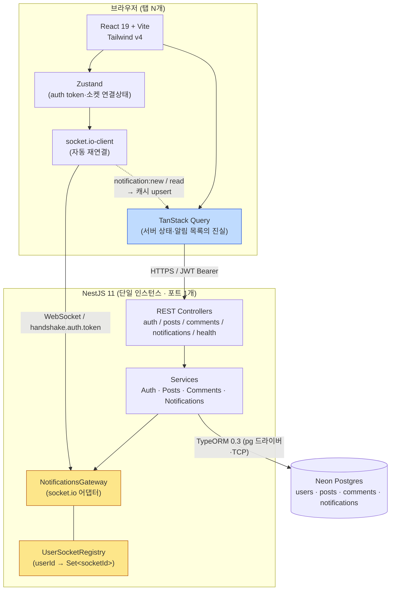
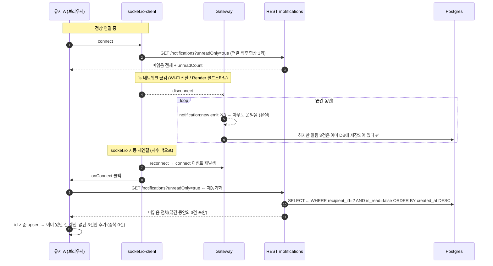

# pingboard

미니 게시판 위에 얹은 **실시간 알림함**. 게시판/댓글은 알림을 발생시키기 위한 최소한의 그릇이고,
이 프로젝트가 실제로 증명하는 것은 **"소켓은 신뢰할 수 없는 채널"이라는 전제 위에서 실시간 알림을 설계하는 법**이다.

- 내 글에 댓글이 달리면 새로고침 없이 즉시 알림 뱃지가 올라간다.
- 접속이 끊긴 동안(와이파이 전환, 서버 재시작 등) 온 알림도 재연결 시 **REST 재동기화**로 전부 채워지고, 소켓 수신분과 **중복 없이** 병합된다.
- 같은 계정으로 탭 여러 개를 열어도 **모든 탭에 동시에** 알림이 도착하고, 한 탭에서 읽으면 나머지 탭 뱃지도 함께 줄어든다.

자세한 설계 배경은 [`SPEC.md`](./SPEC.md) · [`ARCHITECTURE.md`](./ARCHITECTURE.md) · [`DATA-MODEL.md`](./DATA-MODEL.md) · [`API.md`](./API.md)를 참고한다.

## 데모 계정

회원가입 없이 바로 둘러볼 수 있다.

- 로그인 화면의 **"회원가입 없이 둘러보기"** 버튼 한 번이면 `admin` / `admin` 계정으로 로그인된다.
  버튼 아래 안내문: _"회원가입 없이 체험해 볼 수 있습니다."_
- 데모 버튼도 일반 로그인과 동일하게 `POST /auth/login`을 호출하고 비밀번호는 항상 정상 bcrypt 비교를 거친다 — 인증을 우회하는 별도 엔드포인트는 없다.
- 시드 데이터: 게시글 5개, 댓글 4개, admin 앞으로 온 알림 4건(미읽음 2건 + 읽음 2건 — 로그인 직후 뱃지가 `2`로 보인다).
- 일반 계정으로도 둘러볼 수 있다: `demo1@pingboard.dev` / `demo2@pingboard.dev`, 비밀번호 `demo1234`.

## 데모 GIF (이 프로젝트가 증명하는 것)

이 세 시나리오가 pingboard의 유일한 차별점이다. 코드 리뷰가 아니라 **실제 브라우저 자동화(Playwright)로 재현하고 화면을 그대로 녹화**했다.

### ① 실시간 알림 수신 (SC-1)

demo1(오른쪽)이 admin(왼쪽)의 글에 댓글을 달자, admin 화면이 새로고침 없이 즉시 갱신된다.


> 실측: 댓글 저장 응답(201) 이후 수 ms~수십 ms 만에 admin 쪽 알림 뱃지가 올라왔고, 클릭부터 뱃지 반영까지 왕복 총 소요는 1초 미만이었다(SC-1 기준 "1초 이내" 충족).

### ② 오프라인 → 복구 시 재동기화, 중복 0건 (SC-2 / SC-3)

**서버 프로세스를 실제로 kill한 뒤 재기동**하는, DevTools "네트워크 끊김"보다 한 단계 더 가혹한 버전이다.
admin 브라우저를 오프라인으로 고정한 채 (1) 서버 프로세스를 kill → 재기동(인메모리 `UserSocketRegistry`가
완전히 새로 시작되는 콜드스타트 상황)하고, (2) 새로 뜬 서버를 향해 demo1이 댓글 3개를 작성한다.
이 시점까지 admin의 소켓은 새 프로세스에 연결되지 않은 상태라 `notification:new` emit은 전부 유실된다.
그 뒤 admin을 온라인으로 되돌리면 소켓이 재연결되고, 그 순간 REST로 미읽음 전체를 재조회해 3건이 **중복 없이** 채워진다.


> 실측: 재동기화 후 알림 패널 카드 6개(기존 3 + 신규 3) 전부 id 기준 고유, React 리스트 key 중복 경고 없음.
> 순수 네트워크 Offline 토글만으로 돌린 버전도 별도로 실행해 동일하게 통과했다(아래 SC 결과표 참고).

### ③ 다중 탭 동시 브로드캐스트 + 읽음 동기화 (SC-4 / SC-5)

같은 admin 계정으로 탭 3개를 열면 연결 배지가 `연결됨 · 탭 3`으로 오른다. demo2가 댓글을 달면 **3개 탭 모두** 뱃지가 동시에 오르고, 한 탭에서 "모두 읽음"을 누르면 나머지 탭도 함께 0이 된다.


> 실측: 댓글 작성 전/후 뱃지가 3개 탭 모두 `N → N+1`로 동일하게 변했고, "모두 읽음" 이후 3개 탭 모두 `0`으로 수렴했다.

## SC-1 ~ SC-9 QA 결과

SPEC.md 4-1의 성공 기준을 브라우저 자동화(Playwright, 실제 로컬 서버·Neon DB 대상)로 순서대로 재현한 결과다.

| ID   | 기준                                             | 결과                                                                                                      |
| ---- | ------------------------------------------------ | --------------------------------------------------------------------------------------------------------- |
| SC-1 | 1초 이내 실시간 전달                             | ✅ PASS — 응답 후 수십 ms 내 반영, 왕복 총 1초 미만                                                       |
| SC-2 | 재연결 유실 0건 (네트워크 Offline 버전)          | ✅ PASS — 오프라인 중 작성된 3건이 복구 즉시 전부 채워짐                                                  |
| SC-2 | 재연결 유실 0건 (서버 프로세스 kill·재기동 버전) | ✅ PASS — 실제 프로세스 재시작 후에도 3건 전부 채워짐(Registry 초기화와 무관하게 DB가 진실)               |
| SC-3 | 중복 0건                                         | ✅ PASS — 두 버전 모두 알림 id 기준 중복 없음, React key 경고 없음                                        |
| SC-4 | 다중 탭 브로드캐스트                             | ✅ PASS — 3개 탭 모두 동시 반영, 연결 배지 `탭 3`                                                         |
| SC-5 | 읽음 동기화                                      | ✅ PASS — 한 탭에서 모두 읽음 → 나머지 탭도 함께 0                                                        |
| SC-6 | 자기 댓글 무알림                                 | ✅ PASS — 자기 글에 자기 댓글 시 뱃지 변화 없음(단위 테스트 + 육안 재확인)                                |
| SC-7 | 소켓 인증                                        | ✅ PASS — 토큰 없음/위조 모두 `connect_error(UNAUTHORIZED)` 1회, `socket.active=false`로 재연결 루프 없음 |
| SC-8 | 트랜잭션 원자성                                  | ✅ PASS — 단위 테스트(알림 저장 실패 주입 시 댓글도 롤백) 통과                                            |
| SC-9 | 데모 계정                                        | ✅ PASS — 원클릭 로그인, 비밀번호는 항상 정상 bcrypt 검증                                                 |

## 아키텍처

### 시스템 구성



**핵심 배치 원칙 3가지**

1. **DB가 알림의 유일한 진실이다.** 소켓은 "DB에 이미 저장된 사실을 빨리 알려주는 힌트 채널"일 뿐이다. 소켓으로만 존재하는 알림은 없다.
2. **REST와 소켓은 같은 프로세스·같은 포트**를 쓴다(NestJS Gateway는 기본적으로 HTTP 서버를 공유). 포트 1개만 열면 되고, CORS 설정도 한 군데서 관리한다.
3. **프론트에서 알림 목록의 소유자는 TanStack Query 캐시 하나뿐이다.** 소켓 이벤트는 별도 상태를 만들지 않고 캐시를 upsert한다 → 이게 SC-3(중복 0건)의 구조적 근거.

### 재연결 유실 방지 흐름 (SC-2 / SC-3의 근거)



핵심 설계 결정(자세한 근거는 `ARCHITECTURE.md` 3-2절 참고):

1. "마지막 확인 시각 이후" 커서를 클라이언트가 들고 있지 않는다 — `is_read = false`라는 **서버가 소유한 상태**가 곧 재동기화 대상의 정의다.
2. 재동기화 트리거는 소켓의 `connect` 이벤트 하나로 통일한다(최초 연결/재연결 구분 불필요).
3. socket.io `connectionStateRecovery`는 의도적으로 쓰지 않는다 — 이 기능은 복구 실패 시 결국 애플리케이션 재동기화가 필요하므로, 그렇다면 세션 저장·유효기간이라는 추가 변수를 안고 갈 이유가 없다고 판단했다.

## 기술 스택

| 영역                  | 선택                                                                             |
| --------------------- | -------------------------------------------------------------------------------- |
| 백엔드                | NestJS 11, TypeScript                                                            |
| ORM / 마이그레이션    | TypeORM 0.3 (Repository + QueryBuilder), 마이그레이션 CLI                        |
| DB                    | Neon Postgres (서버리스, TCP `pg` 드라이버)                                      |
| 인증                  | Passport-JWT (access token 단일, 1일 만료)                                       |
| 실시간                | `@nestjs/websockets` + `@nestjs/platform-socket.io` (기본 socket.io 어댑터)      |
| 검증                  | class-validator / class-transformer (백엔드), Zod (프론트)                       |
| API 문서              | `@nestjs/swagger` (`GET /docs`)                                                  |
| 테스트                | Jest + supertest (리포지토리 목 기반 단위 테스트, S 티어라 Testcontainers 면제)  |
| 프론트                | Vite + React 19 + TypeScript + Tailwind v4                                       |
| 클라 상태 / 서버 상태 | Zustand / TanStack Query                                                         |
| 실시간 클라           | socket.io-client (자동 재연결)                                                   |
| 배포                  | 프론트 Vercel(예정) · 백엔드 로컬 Docker 기본, Render 라이브는 별도 승인 후 결정 |

## 실행법

### 준비물

- Node.js 22+
- Neon(or 임의의) Postgres 인스턴스 1개
- (선택) Docker

### 1) 백엔드 (`server/`)

```bash
cd server
cp .env.example .env   # DATABASE_URL / JWT_SECRET / JWT_EXPIRES_IN / CORS_ORIGINS / PORT 값을 채운다
npm install

npm run migration:run   # 빈 DB에 스키마 1회 생성 (인덱스 I1~I4 포함)
npm run seed             # admin/admin + demo1/demo2 + 샘플 글·댓글·알림 시드(멱등 — admin 있으면 스킵)

npm run start:dev        # http://localhost:3000, Swagger는 /docs
```

Docker로 실행하려면:

```bash
docker build -t pingboard-server .
docker run --rm -p 3000:3000 \
  -e DATABASE_URL=... -e JWT_SECRET=... -e CORS_ORIGINS=http://localhost:5173 \
  pingboard-server
```

컨테이너는 `migrationsRun: false`로 뜬다 — 마이그레이션/시드는 컨테이너 기동과 무관하게 **로컬에서 같은 `DATABASE_URL`(Neon)을 향해 1회** 실행한다. 프로덕션 이미지는 `npm ci --omit=dev`라 `ts-node`가 없어서 컨테이너 안에서는 마이그레이션 CLI 자체를 실행할 수 없다.

### 2) 프론트엔드 (`client/`)

```bash
cd client
cp .env.example .env   # VITE_API_URL=http://localhost:3000
npm install
npm run dev             # http://localhost:5173 (server가 3000번에 떠 있어야 한다)
```

### 3) 테스트

```bash
cd server
npm test        # 단위 테스트 3개 스위트(리포지토리 목, DB 불필요) — SC-6/SC-7/SC-8을 정확히 겨냥
npm run lint
npm run build
```

## 알려진 한계

프로젝트를 숨김없이 소개하기 위해 `ARCHITECTURE.md` 6장을 그대로 옮긴다.

1. **단일 인스턴스 전용** — 수평 확장 시 Redis 어댑터 필요.
2. **재동기화는 미읽음 전체 조회** — 미읽음이 수천 건 쌓이면 페이로드가 커진다(현재 100건 상한 + 인덱스로 방어). 대규모라면 `since` 커서 방식이 맞다.
3. **localStorage 토큰** — XSS 취약 가능성. 운영 등급이면 httpOnly 쿠키 + 소켓 핸드셰이크 시 쿠키 기반 인증으로 전환해야 한다.
4. **알림 타입 1종** — 확장 시 `type`별 렌더러 분기와 payload 스키마 분리가 필요하다.

그 밖에 확인된 스코프 타협:

- **"내 글" 탭은 클라이언트 사이드 필터**다(`GET /posts?limit=50`을 받아 `author.id === user.id`로 거른다). 전체 게시글이 50건을 넘으면 51번째 이후의 내 글이 이 탭에서 사라진다 — 데모 규모(현재 5건)에서는 재현되지 않는 S 티어 스코프의 타협이다.
- 로그인 레이트리밋은 없다(브루트포스 방어는 스코프 밖).
- 실측 쿼리 수(N+1 없음, `logging: ['query']`로 직접 계수): `GET /posts` 3개(distinct-id / 본문·작성자 조인 / 댓글수 집계) · `GET /posts/:id` 1개(단일 조인) · `GET /notifications` 3개(distinct-id / actor·post·comment 조인 / count).

## 트러블슈팅 (실제로 겪은 문제)

- **컬럼명이 테이블마다 camelCase/snake_case로 섞여 있었다.** `BaseEntity`의 `@CreateDateColumn`에 `name: 'created_at'`을 빠뜨려서 4개 테이블 전부 `createdAt`(camelCase)으로 생성됐는데, 다른 컬럼(`author_id`, `is_read` 등)은 전부 snake_case였다. 설계 문서(DATA-MODEL.md)와 실제 스키마가 어긋나 있었던 것 — `BaseEntity`와 초기 마이그레이션 파일을 함께 고쳐 `created_at`으로 통일했다. 공용 베이스 엔티티에 데코레이터 옵션 하나를 빠뜨리면 테이블 전체에 조용히 퍼진다는 걸 새삼 확인한 사고였다.
- **공개 응답에서 이메일이 새고 있었다.** 로그인 응답용 `UserSummaryDto`(`{id, email, nickname}`)를 `GET /posts`의 작성자·`GET /notifications`의 actor 응답에도 그대로 재사용하는 바람에, 인증 없이 `GET /posts`만 호출해도 전체 가입자 이메일을 모을 수 있었다. "본인에게만 보이는 정보"와 "타인에게 노출되는 정보"의 DTO를 처음부터 분리했어야 했다 — `AuthorSummaryDto{id, nickname}`를 따로 만들고 공개 응답 3곳의 QueryBuilder `addSelect`에서 `email` 컬럼 선택 자체를 제거했다.
- **로컬 빌드와 Docker 빌드의 산출물 경로가 서로 달랐다.** `tsconfig.build.json`이 `scripts`/`migrations`를 제외하지 않아서 로컬 `npm run build`는 `dist/src/main.js`를 만드는데, `package.json`의 `start:prod`와 Dockerfile의 `CMD`는 `dist/main.js`를 가리켰다. Docker 이미지가 그동안 정상 기동됐던 건 빌드 스테이지가 `COPY src ./src`만 해서 우연히 `rootDir`이 `src`로 잡혔기 때문 — `migrations`를 빌드 컨텍스트에 추가하는 사소한 변경만으로도 조용히 깨질 수 있는 구조였다. `tsconfig.build.json`의 `exclude`에 `scripts`/`migrations`를 추가해 로컬·Docker 산출물 경로를 일치시켰다.
- **소켓 인증 실패를 `handleConnection` 안에서 처리하지 않은 이유.** 처음엔 연결을 받은 뒤 토큰을 검사해서 `socket.disconnect()`하는 방식을 고려했는데, socket.io 클라이언트는 이걸 "일시적 끊김"으로 보고 무한 재연결을 시도한다. 그래서 `afterInit`의 `server.use()` 미들웨어에서 `next(new Error('UNAUTHORIZED'))`로 핸드셰이크 자체를 거부하도록 바꿨다 — 이러면 `socket.active`가 `false`가 되어 클라이언트가 재연결을 멈춘다(SC-7). 실제로 위조/만료 토큰으로 붙여보면 `connect_error`가 딱 1번만 발생하고 폴링이 반복되지 않는 걸 확인했다.
- **QA 중 관찰**: 서버 프로세스를 강제로 kill 후 재기동하면서 admin 브라우저를 오프라인→온라인으로 전환하는 테스트에서, 알림 데이터(REST 재동기화) 자체는 항상 정확히 채워졌지만 헤더의 연결 배지 문구가 실제 연결 상태보다 아주 짧게(1~2초) 뒤늦게 "연결됨"으로 바뀌는 순간이 관찰됐다. 브라우저의 강제 오프라인 처리와 socket.io 자체의 online/offline 이벤트 기반 재연결 로직이 겹쳐 생기는 것으로 보이며, 알림 데이터 정합성에는 영향이 없는 표시상의 지연이라 별도 수정 없이 기록만 남긴다.

## 폴더 구조

```
pingboard/
├─ SPEC.md · ARCHITECTURE.md · DATA-MODEL.md · API.md · PLAN.md
├─ docs/demo/           # 데모 GIF 3종
├─ server/               # NestJS + TypeORM + Neon
└─ client/               # Vite + React + TS + Tailwind
```

각 하위 폴더의 세부 구조·구현 안내는 [`server/README.md`](./server/README.md), [`client/README.md`](./client/README.md), 폴더 트리 전체는 `ARCHITECTURE.md` 4장을 참고한다.
